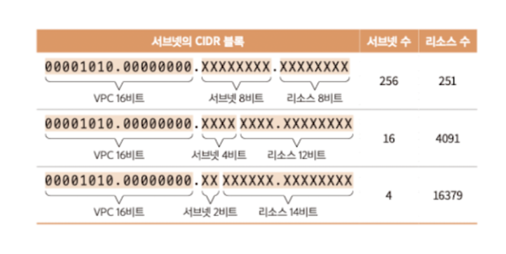

# 4 가상 네트워크 만들기

## 4.1 네트워크

네트워크 : 인프라스트럭쳐 관리자가 주체가 되어 관리하는 장소

- 네트워크 내 기기는 자유롭게 통신할 수 있다 -> LAN(local area network)

## 4.2 VPC

### 4.2.1 vpc란?

AWS를 이용해 네트워크를 구축할 때는 VPC(amazon virtual private cloud, amazon VPC)시스템을 이용할 수 있다.

### 4.2.2 생성 내용

VPC를 생성할 때는 사전에 네트워크 정보를 결정해야 한다

| 항목           | 값               | 설명                               |
|--------------|-----------------|----------------------------------|
| 이름 태그        | vpc_name        | vpc를 식별하는 이름                     |
| IPv4 CIDR 블록 | 10.0.0.0/16     | VPC에서 이용하는 프라이빗 네트워크의 IPv4 주소 범위 |
| IPv6 CIDR 블록 | IPv6 CIDR 블록 없음 | VPC에서 이용하는 프라이빗 네트워크의 IPv6 주소 범위 |
| 테넌시 | 기본값 | VPC 리소스의 전용 하드웨어에서의 실행 여부|

> [!NOTE]  
> CIDR
> [ip 및 CIDR 자세히 보기](ip.md)

## 4.3 서브넷과 가용 영역
### 4.3.1 서브넷과 가용 영역

VPC 안에는 하나 이상의 서브넷을 만들어야 한다. 서브넷은 VPC의 ip주소 범위를 나눈다.
ip주소 범위를 나누는 대표적 이유는
- 역할 분리 (외부에 공개하는 리소스 여부를 구별)
- 기기 분리 (aws 안에서의 물리적인 이중화 수행)

