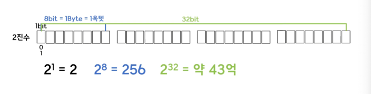
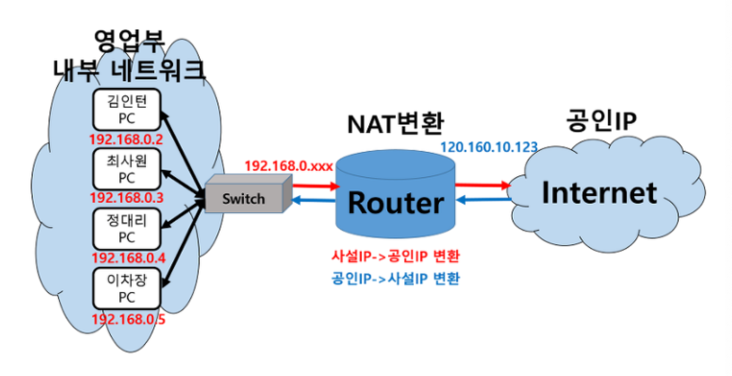
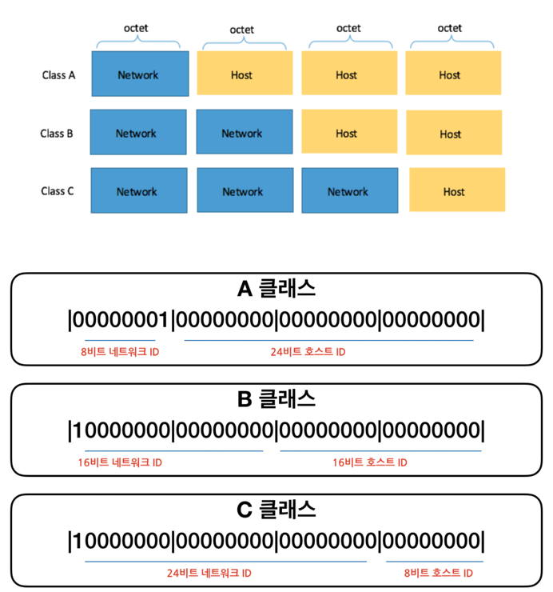
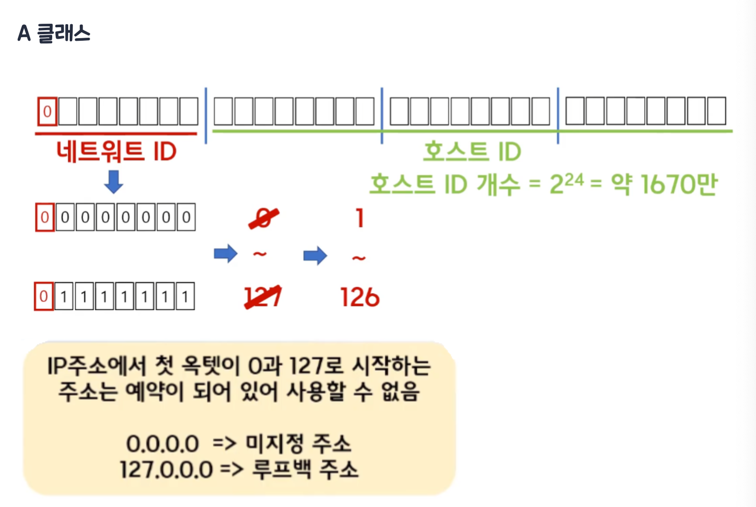

# ip

## ipv4

ipv4 주소는 32bit로 이루어진 주소이며 약 43억개 주소를 가지게 된다.

하지만 전세계적으로 인터넷 사용자수가 급증하면서 ipv4주소가 고갈될 위기에 있다.

이를 위해 ipv6로 ipv4의 주소체계를 128bit 크기로 확장한 주소를 사용한다.
하지만 기존 주소체계를 변경하는데 비용이 많이 들어 사용화되지 않았다.

## 사설 Ip

사설IP는 어떤 네트워크 안에서 내부적으로 사용되는 고유한 주소이다. 따라서 건국대학교 안에서 사용하는 192.168.10.2 아이피와 숭실대학교 안에서 사용하는 192.168.10.2 아이피는 번호는 같을지언정 전혀 다른 목적지 주소를 나타내게 된다.

NAT(network address translation)을 통해 사설ip와 공인ip간 인터넷 주소 번역이 가능하다.

출처: https://inpa.tistory.com/entry/WEB-🌐-IP-기초-사설IP-공인IP-NAT-개념-정말-쉽게-정리 [Inpa Dev 👨‍💻:티스토리]

## ip주소 구성

ip = 네트워크 id + 호스트 id

- 네트워크 id : 각 국가마다 부여한 network id

ip주소 클래스 (ip클래스는 예전에 ipv4를 사용했을 때 ip를 할당하는 방법)

- ip주소를 8비트로 4등분을 한 각각을 옥텟(octet)이라 함
- 각 옥텟별로 0~255개의 범위가 되므로 256개 숫자가 들어갈 수 있음

### A클래스

A클래스의 첫 번째 옥텟의 비트는 0으로 고정, A클래스의 범위는 첫 옥텟이 1~126 사이의 숫자로 시작
호스트id 대역이 24bit로, 네트워크당 나올 수 있는 호스트 주소 갯수가 약 1670만개 -> 대규모 네트워크에 적합

### B클래스

B클래스는 첫번째 옥텟의 두 번째 비트가 10으로 고정

### C클래스

C클래스는 첫번째 옥텟의 세번째 비트가 110으로 고정

### D클래스

D클래스는 첫번째 옥텟의 세번째 비트가 1110으로 고정

** 가장 첫번째 호스트 주소는 **네트워크** 주소를 지칭, 마지막 주소는 **브로드캐스트용 주소** 지칭
** 브로드캐스트용 주소 : 네트워크의 모든 호스트로 데이터를 전달하기 위한 통로로서의 주소

> [!NOTE]  
> ipv4주소를 ip클래스로 나누었지만 오히려 비효율적
> -> 서브넷(subnet)사용

## 서브넷 마스크

ip주소 크기와 똑같이 32비트 2진수로 표현. 크기가 똑같은 이유는 ip주소와 서브넷 마스크를 AND연산하기 위해서 이다.
서브넷 마스크는 연속된 1과 0으로 구성

### prefix 표현

> IP 주소에서 192.168.0.1/24라고 되어있다. 이는 C 클래스이며 기본 서브넷 마스크는 255.255.255.0이다. 우리가 아는 A, B, C 클래스에는 각각의 기본 서브넷 마스크가 존재하여 네트워크 영역과 호스트 영역으로 나뉜다. 결국 각각의 클래스가 가지고 있는 기본 서브넷마스크으로 인해서 네트워크 영역과 호스트 영역이 정해지는 것이다.
> 
> 앞에서부터 1개수를 세면 24개이다. 이는 /24로 표현한다.

출처: https://github.com/im-d-team/Dev-Docs/blob/master/Network/Subnetmask.md
     
https://inpa.tistory.com/entry/WEB-IP-%ED%81%B4%EB%9E%98%EC%8A%A4-%EC%84%9C%EB%B8%8C%EB%84%B7-%EB%A7%88%EC%8A%A4%ED%81%AC-%EC%84%9C%EB%B8%8C%EB%84%B7%ED%8C%85-%EC%B4%9D%EC%A0%95%EB%A6%AC
