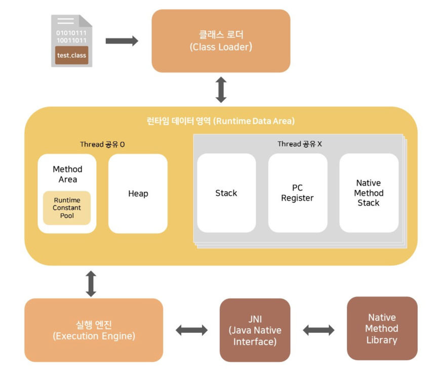

# 2.2 런타임 데이터 영역

자바 가상 머신은 자바 프로그램을 실행하는 동안 필요한 메모리를 몇 개의 데이터 영역으로 나눠 관리한다.

[출처 : https://jellili.tistory.com/55]

## 2.2.1 프로그램 카운터
프로그램 카운터 레지스터는 작은 메모리 영역으로, 현재 실행 중인 스레드의 '바이트 코드 줄 번호 표시기'라고 생각하면 직관적이다.

바이트코드 인터프리터는 이 카운터의 값을 바꿔 다음에 실행할 바이트코드 명령어를 선택하는 식으로 동작한다. 프로그램의 제어 흐름, 분기, 순환, 점프를 표시하고, 예외 처리나 스레드 복원 기능이 이 표시기를 통해 이루어진다.

## 2.2.2 자바 가상 머신 스택
jvm에서 멀티스레딩은 cpu코어를 여러 스레드가 교대로 사용하는 방식으로 구현되어 스레드 전환 후 이전에 실행하다 멈춘 지점을 정확하게 복원하려면 스레드 각각에 고유한 프로그램 카운터 및 메모리가 필요하다. 이를 '스레드 프라이빗 메모리' 라고 한다.
자바 가상 머신 스택도 '스레드 프라이빗'하다.

각 메서드가 호출될 때마다 자바 가상머신은 스택 프레임으르 만들어 지역 변수 테이블, 피연산자 스택, 동적 링크, 메서드 반환값 정보들을 저장한다. 이를 가상 머신 스택에 푸시(push)하고, 메서드가 끝나면 팝(pop)한다.

자바의 메모리 영역을 힙 메모리와 스택 메모리로 구분하는 사람이 많다. 이는 전통적인 c, c++ 프로그램의 메모리 구조에서 기인한 것으로 자바 언어를 설명하기엔 무리가 있다.
자바의 메모리 구조에서 기인한 것으로 자바 언어를 설명하기에는 무리가 있다. 
스택이라 하면, 보통 자바 가상 머신 스택의 '지역 변수 테이블'을 가리킬 때가 많다.

지역 변수 테이블에는 자바 가상 머신이 컴파일 타임에 알 수 있는 다양한 기본 데이터 타입, 객체 참조, 반환 주소 타입을 저장한다.

## 2.2.3 네이티브 메서드 스택
네이티브 메서드 스택은 자바 가상 머신 스택과 매우 비슷한 역할을 한다. 차이점은 네이티브 메서드 스택은 네이티브 메서드를 실행할 때 사용한다는 것.

## 2.2.4 자바 힙
자바 힙은 모든 스레드가 공유하며 가상 머신이 구동될 때 만들어진다. 
자바 힙은 가비지 컬렉터가 관리하는 메모리 영역이기 때문에 GC 힙이라고도 한다. 

## 2.2.5 메서드 영역
가상 머신이 읽어 들인 타입 정보, 상수, 정적 변수 그리고 컴파일한 코드 캐시 등을 저장하는 데 이용된다. 

## 2.2.6 런타임 상수 풀
런타임 상수 풀은 메서드 영역의 일부다. 런타임에도 메서드 영역의 런타임 상수 풀에 새로운 상수가 추가될 수 있다. 개발자들이 많이 사용하는 String클래스의 intern() 메서드에 바로 이 특성이 반영되어 있다.

> [!NOTE]  
> https://simple-ing.tistory.com/3  -> string intern()

