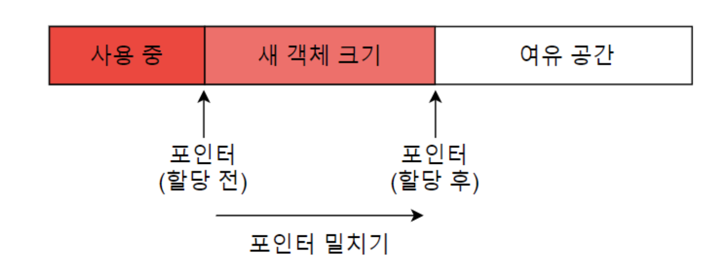
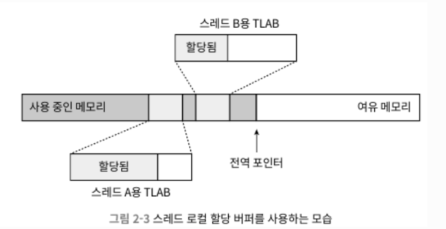

# 2.3 핫스팟 가상 머신에서의 객체 들여다보기

가장 보편적인 가상 머신인 핫스팟과 가장 보편적인 메모리 영역인 자바 힙을 예로 설명해보자.
- 자바 힙에서의 객체 생성, 레이아웃, 접근 방법

이걸 중심으로 보자.

## 2.3.1 객체 생성

언어 수준에서 객체 생성은 보통 단순히 new 키워드를 쓰면 끝난다. 과연 가상 머신 수준에서는 단순할까?

자바 가상 머신이 new 명령에 해당하는 바이트코드를 만나면, 이 명령의 매개 변수가 상수 풀 안의 클래스를 가리키는 심벌 참조인지 확인한다. 그런 다음 이 심벌 참조가 뜻하는 클래스가 로딩, 해석, 초기화되었는지 확인한다.

로딩이 완료된 클래스라면, 새 객체를 담을 메모리를 할당한다. 객체용 메모리 공간 할당은 자바 힙에서 특정 크기의 메모리 블록을 잘라 주는 일이라 할 수 있다.
이러한 할당 방식을 포인터 밀치기(bump the pointer)라 한다.

[출처: https://jaeseo0519.tistory.com/438]

위 경우의 포인터 밀치기는 자바 힙이 완벽히 규칙적이라 가정한 것이다. 사용중인 메모리는 모두 한쪽에, 여유 메모리는 반대편에 자리하는 상황이다.

> 하지만! 자바 힙은 규칙적이지 않다

사용중인 메모리와 여유 메모리가 뒤섞여 있어서 포인터를 밀쳐 내기가 그리 간단하지 않다.
대신, 가상 머신은 가용 메모리 블록들을 목록으로 따로 관리하며, 객체 인스턴스를 담기에 충분한 공간을 찾아 할당한 후 목록을 갱신한다.
이 할당 방식을 여유 목록(free list)라 한다.

위와 같이 가용 공간을 어떻게 나눌지에 대한 고민은 가비지 컬렉터의 능력 또한 고려해야 한다.

가용 공간을 어떻게 나눌지 외에도 고민해야될 부분이 있다.

멀티스레딩 환경에서 여유 메모리의 시작 포인터 위치를 수정하는 단순한 일도 스레드 안전하지 않기에
여러 스레드가 동시에 객체를 생성하려고 할때 문제가 생길 수 있다. 예컨대 한 스레드가 요청한 객체A를 위해 메모리를 할당하는 과정에서, 포인터의 값을 아직 수정하기 전, 다른 스레드가 객체 B용 메모리를 요청할 수 있다.

해법은 두 가지다.

> [!NOTE]  
> 첫번째, 메모리 할당을 동기화하는 법!

실제로 비교 교환과 실패시 재시도 방식의 가상 머신은 갱신을 원자적으로 수행한다.

> [!NOTE]  
> 두번째, 스레드마다 다른 메모리 공간을 할당하는 방법!

이런 메모리를 스레드 로컬 할당 버퍼(TLAB)라고 한다.

각 스레드는 로컬 버퍼에서 메모리를 할당 받아 사용하다가 버퍼가 부족해지면 그때 동기화를 해 새로운 버퍼를 할당받는 식이다.

[출처: https://lima1016.tistory.com/m/124]

스레드 로컬 할당 버퍼를 사용한다면 초기화는 TLAB 할당 시 미리 수행된다. 

> [!TIP]
> 자바 코드에서 객체의 인스턴스 필드를 초기화하지 않고도 사용할 수 있는 이유가 이 단계 덕이다.

